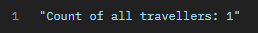
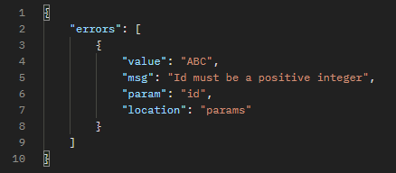
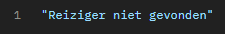

# Kyana Marckx (202183241)

## Vak

- Web Services:
  - [GitHub repository](https://github.com/Web-IV/2223-webservices-kyanamarckx)
  - [Online versie](https://webservices-kyanamarckx.onrender.com)

## Logingegevens

### User met read en write permissies:
- **Gebruikersnaam/e-mailadres**: online@gmail.com
- **Wachtwoord**: Online123
- **Body in Postman**: `{"grant_type":"password","username":"online@gmail.com","password":"Online123","audience":"https://vacay.kyana-hogent.be","scope":"read write","client_id":"sJUibowqneIEBIvxyeLQd869uivdTHuP","client_secret":"akPiwhNalFp6QXm8LlP7s38cCxoI5SP4pCropiZNKjBZ_kI0isxsN6UlwVkvsji4"}`

### User met read permissies:
- **Gebruikersnaam/e-mailadres**: read@gmail.com
- **Wachtwoord**: Read-123
- **Body in Postman**: `{"grant_type":"password","username":"read@gmail.com","password":"Read-123","audience":"https://vacay.kyana-hogent.be","scope":"read","client_id":"sJUibowqneIEBIvxyeLQd869uivdTHuP","client_secret":"akPiwhNalFp6QXm8LlP7s38cCxoI5SP4pCropiZNKjBZ_kI0isxsN6UlwVkvsji4"}`

### User met geen permissies:
- **Gebruikersnaam/e-mailadres**: none@gmail.com
- **Wachtwoord**: None-123
- **Body in Postman**: `{"grant_type":"password","username":"none@gmail.com","password":"None-123","audience":"https://vacay.kyana-hogent.be","scope":"openid profile email offline_access","client_id":"sJUibowqneIEBIvxyeLQd869uivdTHuP","client_secret":"akPiwhNalFp6QXm8LlP7s38cCxoI5SP4pCropiZNKjBZ_kI0isxsN6UlwVkvsji4"}`

### Link
- https://webservices-kyanamarckx.onrender.com/api/
  - reizigers/
    - :id
    - count
    - auth0id/:id
  - bestemmingen/
    - :id
    - count
  - vervoersmiddelen/
    - :id
    - count
  - verplaatsingen/
    - :id
    - count

## Projectbeschrijving

Dit project is een API dat te maken heeft met op vakantie gaan. Er zijn 4 tabellen aanwezig: Reiziger, Bestemming, Vervoersmiddel en Verplaatsing. 

Van de reiziger wordt er een id, voornaam, naam, geboortedatum (in de vorm van YYYY-MM-DD), stad, straat en huisnummer bijgehouden. 

Van de bestemming wordt er een id, land, stad en postcode bijgehouden.

Van het vervoersmiddel wordt er een id en type (bijvoorbeeld auto, vliegtuig, boot, ...) bijgehouden.

Van de verplaatsing wordt er een id, vervoersmiddel_id, reiziger_id en bestemming_id bijgehouden. Deze id's zijn de id's van de Reiziger-, Bestemming- en Vervoersmiddeltabellen. Een verplaatsing is dus eigenlijk een tabel die bijhoudt welke reiziger naar welke bestemming is gereisd en met welk vervoersmiddel dit gebeurde.

De bedoeling van deze API is dat gebruikers (hier de reizigers zelf) hun vakanties kunnen toevoegen of aanpassen en dat buitenstaanders die een account hebben deze reizen kunnen bekijken om inspiratie op te doen voor hun volgende vakantie.

## Screenshots

### Console
Voorbeeld van de logger na het uitvoeren van verscheidene requests:

### Postman

GetAll request:

GetCount request:

GetById met fout id request:

GetById met onbestaand id:

## Behaalde minimumvereisten

### Web Services

- **Datalaag**

  - [x] voldoende complex (meer dan één tabel)
  - [x] één module beheert de connectie + connectie wordt gesloten bij sluiten server
  - [ ] heeft migraties
  - [x] heeft seeds
 

- **Repositorylaag** (valt weg door gebruik van Prisma)

  - [ ] definieert één repository per entiteit (niet voor tussentabellen) - indien van toepassing
  - [ ] mapt OO-rijke data naar relationele tabellen en vice versa
 

- **Servicelaag met een zekere complexiteit**

  - [x] bevat alle domeinlogica
  - [x] bevat geen SQL-queries of databank-gerelateerde code
 

- **REST-laag**

  - [x] meerdere routes met invoervalidatie
  - [x] degelijke foutboodschappen
  - [x] volgt de conventies van een RESTful API
  - [x] bevat geen domeinlogica
  - [x] degelijke authorisatie/authenticatie op alle routes
 

- **Varia**
  - [x] een aantal niet-triviale testen (min. 1 controller >=80% coverage)
  - [x] minstens één extra technologie
  - [x] duidelijke en volledige `README.md`
  - [x] maakt gebruik van de laatste ES6-features (object destructuring, spread operator...)
  - [x] volledig en tijdig ingediend dossier

## Projectstructuur

### Web Services

Ik heb een gelaagde applicatie geschreven voor mijn vakantie-API:
- `__tests__`: alles wat te maken heeft met testen
- `config`: variabelen
- `images`: screenshots van het gebruik van de API en de resultaten van de testen
- `prisma`: opbouw van prisma-schema en seeds
- `src`: opstarten van de server
- `src/core`: authenticatie en service errors
- `src/rest`: aanmaak routers en foutafhandeling van requests
- `src/service`: zorgt voor de requests en legt connectie met de databank om die requests uit te voeren
- `src/utils`: aanmaak van de database

## Extra technologie

### Web Services

#### Prisma ORM

Door te werken met een ORM (Object-Relational Mapping) gebeurt er een *makkelijkere* communicatie met de databank en is het ook een andere manier om de databank aan te maken / aan te passen en er data aan toe te voegen.

Package: [`npm install prisma`](https://www.npmjs.com/package/prisma)

#### TypeScript

Het grootste verschil tussen JavaScript en TypeScript is dat TypeScript veel strikter is in het definen van functies, variabelen, types, ... . Het kan gezien worden als de 'strict version of JavaScript' aangezien het achter de schermen compiled naar JavaScript en uiteindelijk daarin wel runt.

Package: [`npm install typescript`](https://www.npmjs.com/package/typescript)

## Testresultaten

### Web Services

Al de tests moeten per file gerunned worden, anders worden er met de testuser te veel requests gestuurd waardoor de user geblocked wordt door Auth0 en Axios je een error 'Too many requests, 429' teruggeeft.

#### reiziger.test.ts

De beforeAll en afterAll zorgen dat server wordt gestart en gestopt aan het begin en einde van de testfile. 

##### GET requests
1) ***GET ALL*** test op de response van /api/reizigers, die alle reizigers in de databank en een statuscode van 200 moet weergeven.
2) ***GET COUNT*** test op de response van /api/reizigers/count, die het aantal reizigers in de databank en een statuscode van 200 moet weergeven.
3) ***GET BY ID*** test op de response van /api/reizigers/:id, hier zijn er 3 mogelijke scenario's: 
   1) Een correct id wordt meegegeven en returned de reiziger met een statuscode van 200.
   2) Een fout id wordt meegegeven (een string, negatief getal, ...) en returned een gepaste foutboodschap met een statuscode van 400.
   3) Een onbestaand id wordt meegegeven (een id dat geldig zou kunnen zijn maar waar er geen reiziger van bestaat) en returned een gepaste foutmelding met een statuscode van 404.
4) ***GET BY AUTH0ID*** test op de response van /api/reizigers/auth0/:id, hier zijn er 3 mogelijke scenario's:
   1) Een correct auth0id wordt meegegeven en returned de reiziger met een statuscode van 200.
   2) Een fout auth0id wordt meegegeven (te kort, ...) en returned een gepaste foutboodschap met een statuscode van 400.
   3) Een onbestaand auth0id wordt meegegeven (een auth0id dat geldig zou kunnen zijn maar waar er geen reiziger van bestaat) en returned een gepaste foutmelding met een statuscode van 404.
   
##### POST requests
1) ***POST*** test op de response van /api/reizigers, hier zijn er 2 mogelijke scenario's:
   1) Een correcte body wordt meegegeven en returned de nieuwe reiziger met een statuscode van 201.
   2) Een foute body wordt meegegeven (verkeerde waarde in parameters, ontbrekende parameters, lege waarde parameters, ...) en returned een gepaste foutmelding met een statuscode van 400.

##### PUT requests
1) ***PUT*** test op de response van /api/reizigers/:id, hier zijn er 5 mogelijke scenario's:
   1) Een correct id en correcte body worden meegegeven en returned de geüpdate reiziger met een statuscode van 200.
   2) Een fout id en correcte body worden meegegeven en returned een gepaste foutboodschap met een statuscode van 400.
   3) Een correct id en foute body worden meegegeven en returned een gepaste foutmelding met een statuscode van 400.
   4) Een fout id en foute body worden meegegeven en returned een gepaste foutmelding met een statuscode van 400.
   5) Een onbestaand id en correcte body worden meegegeven en returned een gepaste foutmelding met een statuscode van 500.

##### DELETE requests
1) ***DELETE*** test op de response van /api/reizigers/:id, hier zijn er 3 mogelijke scenario's:
   1) Een correct id wordt meegegeven en returned een statuscode van 204.
   2) Een fout id wordt meegegeven en returned een gepaste foutmelding met eens statuscode van 400.

##### RESULTS

##### COVERAGE

#### bestemming.test.ts

De beforeAll en afterAll zorgen dat server wordt gestart en gestopt aan het begin en einde van de testfile. 

##### GET requests
1) ***GET ALL*** test op de response van /api/bestemmingen, die alle bestemmingen in de databank en een statuscode van 200 moet weergeven.
2) ***GET COUNT*** test op de response van /api/bestemmingen/count, die het aantal bestemmingen in de databank en een statuscode van 200 moet weergeven.
3) ***GET BY ID*** test op de response van /api/bestemmingen/:id, hier zijn er 3 mogelijke scenario's: 
   1) Een correct id wordt meegegeven en returned de bestemming met een statuscode van 200.
   2) Een fout id wordt meegegeven (een string, negatief getal, ...) en returned een gepaste foutboodschap met een statuscode van 400.
   3) Een onbestaand id wordt meegegeven (een id dat geldig zou kunnen zijn maar waar er geen bestemming van bestaat) en returned een gepaste foutmelding met een statuscode van 404.
   
##### POST requests
1) ***POST*** test op de response van /api/bestemmingen, hier zijn er 2 mogelijke scenario's:
   1) Een correcte body wordt meegegeven en returned de nieuwe bestemming met een statuscode van 201.
   2) Een foute body wordt meegegeven (verkeerde waarde in parameters, ontbrekende parameters, lege waarde parameters, ...) en returned een gepaste foutmelding met een statuscode van 400.

##### PUT requests
1) ***PUT*** test op de response van /api/bestemmingen/:id, hier zijn er 5 mogelijke scenario's:
   1) Een correct id en correcte body worden meegegeven en returned de geüpdate bestemming met een statuscode van 200.
   2) Een fout id en correcte body worden meegegeven en returned een gepaste foutboodschap met een statuscode van 400.
   3) Een correct id en foute body worden meegegeven en returned een gepaste foutmelding met een statuscode van 400.
   4) Een fout id en foute body worden meegegeven en returned een gepaste foutmelding met een statuscode van 400.
   5) Een onbestaand id en correcte body worden meegegeven en returned een gepaste foutmelding met een statuscode van 500.

##### DELETE requests
1) ***DELETE*** test op de response van /api/bestemmingen/:id, hier zijn er 3 mogelijke scenario's:
   1) Een correct id wordt meegegeven en returned een statuscode van 204.
   2) Een fout id wordt meegegeven en returned een gepaste foutmelding met eens statuscode van 400.

##### RESULTS

##### COVERAGE

#### vervoermsiddel.test.ts

De beforeAll en afterAll zorgen dat server wordt gestart en gestopt aan het begin en einde van de testfile. 

##### GET requests
1) ***GET ALL*** test op de response van /api/vervoersmiddelen, die alle vervoersmiddelen in de databank en een statuscode van 200 moet weergeven.
2) ***GET COUNT*** test op de response van /api/vervoersmiddelen/count, die het aantal vervoersmiddelen in de databank en een statuscode van 200 moet weergeven.
3) ***GET BY ID*** test op de response van /api/vervoersmiddelen/:id, hier zijn er 3 mogelijke scenario's: 
   1) Een correct id wordt meegegeven en returned het vervoersmiddel met een statuscode van 200.
   2) Een fout id wordt meegegeven (een string, negatief getal, ...) en returned een gepaste foutboodschap met een statuscode van 400.
   3) Een onbestaand id wordt meegegeven (een id dat geldig zou kunnen zijn maar waar er geen vervoersmiddel van bestaat) en returned een gepaste foutmelding met een statuscode van 404.
   
##### POST requests
1) ***POST*** test op de response van /api/vervoersmiddelen, hier zijn er 2 mogelijke scenario's:
   1) Een correcte body wordt meegegeven en returned het nieuwe vervoersmiddel met een statuscode van 201.
   2) Een foute body wordt meegegeven (verkeerde waarde in parameters, ontbrekende parameters, lege waarde parameters, ...) en returned een gepaste foutmelding met een statuscode van 400.

##### PUT requests
1) ***PUT*** test op de response van /api/vervoersmiddelen/:id, hier zijn er 5 mogelijke scenario's:
   1) Een correct id en correcte body worden meegegeven en returned het geüpdate vervoersmiddel met een statuscode van 200.
   2) Een fout id en correcte body worden meegegeven en returned een gepaste foutboodschap met een statuscode van 400.
   3) Een correct id en foute body worden meegegeven en returned een gepaste foutmelding met een statuscode van 400.
   4) Een fout id en foute body worden meegegeven en returned een gepaste foutmelding met een statuscode van 400.
   5) Een onbestaand id en correcte body worden meegegeven en returned een gepaste foutmelding met een statuscode van 500.

##### DELETE requests
1) ***DELETE*** test op de response van /api/vervoermsiddelen/:id, hier zijn er 3 mogelijke scenario's:
   1) Een correct id wordt meegegeven en returned een statuscode van 204.
   2) Een fout id wordt meegegeven en returned een gepaste foutmelding met eens statuscode van 400.

##### RESULTS

##### COVERAGE

#### verplaatsing.test.ts

De beforeAll en afterAll zorgen dat server wordt gestart en gestopt aan het begin en einde van de testfile. 

##### GET requests
1) ***GET ALL*** test op de response van /api/verplaatsingen, die alle verplaatsingen in de databank en een statuscode van 200 moet weergeven.
2) ***GET COUNT*** test op de response van /api/verplaatsingen/count, die het aantal verplaatsingen in de databank en een statuscode van 200 moet weergeven.
3) ***GET BY ID*** test op de response van /api/verplaatsingen/:id, hier zijn er 3 mogelijke scenario's: 
   1) Een correct id wordt meegegeven en returned de verplaatsing met een statuscode van 200.
   2) Een fout id wordt meegegeven (een string, negatief getal, ...) en returned een gepaste foutboodschap met een statuscode van 400.
   3) Een onbestaand id wordt meegegeven (een id dat geldig zou kunnen zijn maar waar er geen vervoersmiddel van bestaat) en returned een gepaste foutmelding met een statuscode van 404.
   
##### POST requests
1) ***POST*** test op de response van /api/verplaatsingen, hier zijn er 2 mogelijke scenario's:
   1) Een correcte body wordt meegegeven en returned de nieuwe verplaatsing met een statuscode van 201.
   2) Een foute body wordt meegegeven (verkeerde waarde in parameters, ontbrekende parameters, lege waarde parameters, ...) en returned een gepaste foutmelding met een statuscode van 400.

##### PUT requests
1) ***PUT*** test op de response van /api/verplaatsingen/:id, hier zijn er 5 mogelijke scenario's:
   1) Een correct id en correcte body worden meegegeven en returned de geüpdate verplaatsing met een statuscode van 200.
   2) Een fout id en correcte body worden meegegeven en returned een gepaste foutboodschap met een statuscode van 400.
   3) Een correct id en foute body worden meegegeven en returned een gepaste foutmelding met een statuscode van 400.
   4) Een fout id en foute body worden meegegeven en returned een gepaste foutmelding met een statuscode van 400.
   5) Een onbestaand id en correcte body worden meegegeven en returned een gepaste foutmelding met een statuscode van 500.

##### DELETE requests
1) ***DELETE*** test op de response van /api/verplaatsingen/:id, hier zijn er 3 mogelijke scenario's:
   1) Een correct id wordt meegegeven en returned een statuscode van 204.
   2) Een fout id wordt meegegeven en returned een gepaste foutmelding met eens statuscode van 400.

##### RESULTS

##### COVERAGE

## Gekende bugs

### Web Services

Niet aanwezig.
